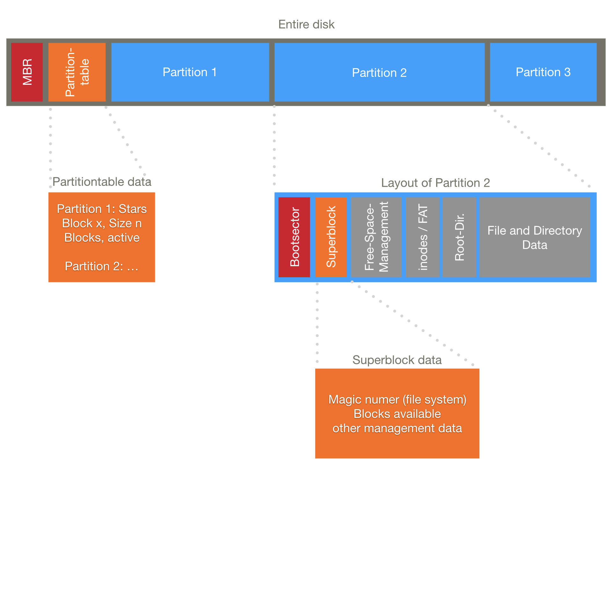

# 1. Table of Contents
- [1. Table of Contents](#1-table-of-contents)
- [2. Definitions/Taxonomy](#2-definitionstaxonomy)
  - [2.1. Operating System](#21-operating-system)
  - [2.2. Applications](#22-applications)
  - [2.3. System Software](#23-system-software)
  - [2.4. Kernel](#24-kernel)
  - [2.5. Software Development Tools](#25-software-development-tools)
  - [2.6. UI](#26-ui)
  - [2.7. Realtime](#27-realtime)
    - [2.7.1. Hard realtime](#271-hard-realtime)
    - [2.7.2. Soft realtime](#272-soft-realtime)
  - [2.8. Classification of OS](#28-classification-of-os)
    - [2.8.1. Usage](#281-usage)
    - [2.8.2. Tasks/Users](#282-tasksusers)
    - [2.8.3. Environment](#283-environment)
    - [2.8.4. Hardware to be used on](#284-hardware-to-be-used-on)
    - [2.8.5. Kernel type](#285-kernel-type)
  - [2.9. Kernel Mode and User Mode](#29-kernel-mode-and-user-mode)
    - [2.9.1. Kernel mode](#291-kernel-mode)
    - [2.9.2. User Mode](#292-user-mode)
  - [2.10. Function calls, system calls and interrupt handling](#210-function-calls-system-calls-and-interrupt-handling)
    - [2.10.1. Function calls](#2101-function-calls)
    - [2.10.2. System Calls](#2102-system-calls)
    - [2.10.3. Interrupt handling](#2103-interrupt-handling)
  - [2.11. API](#211-api)
  - [2.12. Algorithm ➜ Programme ➜ Process ➜ Thread](#212-algorithm--programme--process--thread)
    - [2.12.1. Algorithm](#2121-algorithm)
    - [2.12.2. Programme](#2122-programme)
    - [2.12.3. Process ( = task)](#2123-process---task)
    - [2.12.4. Process live cycle](#2124-process-live-cycle)
    - [2.12.5. Start of a process](#2125-start-of-a-process)
    - [2.12.6. Process Attributes](#2126-process-attributes)
  - [2.13. Scheduling](#213-scheduling)
    - [2.13.1. Attributes needed for Scheduling](#2131-attributes-needed-for-scheduling)
    - [2.13.2. Inter-Process Communication (IPC)](#2132-inter-process-communication-ipc)
    - [2.13.3. Thread](#2133-thread)
  - [2.14. Booting](#214-booting)
  - [2.15. Files](#215-files)
    - [2.15.1. Operations on files:](#2151-operations-on-files)
  - [2.16. Memory hirarchy](#216-memory-hirarchy)
    - [2.16.1. Cache](#2161-cache)
    - [2.16.2. RAM](#2162-ram)
    - [2.16.3. HDD and SSD](#2163-hdd-and-ssd)
- [3. Memory organization](#3-memory-organization)
  - [3.1. Fixed-size pages](#31-fixed-size-pages)
  - [3.2. Flexible sized chunks](#32-flexible-sized-chunks)
  - [3.3. Memory Allocation for variable size allocations:](#33-memory-allocation-for-variable-size-allocations)
  - [3.4. Free memory management](#34-free-memory-management)
    - [3.4.1. Linked list](#341-linked-list)
    - [3.4.2. Bitmap](#342-bitmap)
- [4. Memory Access](#4-memory-access)
- [5. Virtual Memory](#5-virtual-memory)
  - [5.1. Overlays](#51-overlays)
  - [5.2. Swapping](#52-swapping)
  - [5.3. Virtual RAM](#53-virtual-ram)
  - [5.4. Memory Management Unit MMU](#54-memory-management-unit-mmu)
  - [5.5. Page fault](#55-page-fault)
- [6. Swapping Algorithms](#6-swapping-algorithms)
  - [6.1. Recently used Class Algorithm](#61-recently-used-class-algorithm)
  - [6.2. Not Frequently Used](#62-not-frequently-used)
  - [6.3. Aging](#63-aging)
  - [6.4. NRU Decision making table](#64-nru-decision-making-table)
  - [6.5. First in First out (FIFO)](#65-first-in-first-out-fifo)
  - [6.6. Second-Chance](#66-second-chance)
  - [6.7. Working Set Algorithm](#67-working-set-algorithm)
  - [6.8. Paging Deamon](#68-paging-deamon)
  - [6.9. Swap-Files and Swap-Partitions](#69-swap-files-and-swap-partitions)
  - [6.10. Memory Compression](#610-memory-compression)
- [7. Storage Devices](#7-storage-devices)
  - [7.1. Tape Drives](#71-tape-drives)
  - [7.2. Floppy Disks](#72-floppy-disks)
  - [7.3. Hard Disk drives](#73-hard-disk-drives)
  - [7.4. Flash Drives and Solid State Drives](#74-flash-drives-and-solid-state-drives)
  - [7.5. Optical disks](#75-optical-disks)
- [8. Files and File Formats](#8-files-and-file-formats)
  - [8.1. Unix](#81-unix)
  - [8.2. Windows](#82-windows)
  - [8.3. Layout of an executable](#83-layout-of-an-executable)
  - [8.4. Layout of .exe files](#84-layout-of-exe-files)
  - [8.5. Disk Layout](#85-disk-layout)
  - [8.6. Continuous Allocation](#86-continuous-allocation)
  - [8.7. Linked Lists](#87-linked-lists)
  - [8.8. File Allocation Table FAT](#88-file-allocation-table-fat)
  - [8.9. inode (On unix systems)](#89-inode-on-unix-systems)
  - [8.10. File names](#810-file-names)
  - [8.11. Subdirectories](#811-subdirectories)
  - [8.12. Soft links](#812-soft-links)
  - [8.13. Hard links](#813-hard-links)
  - [8.14. Access control](#814-access-control)
    - [8.14.1. Capabilities](#8141-capabilities)
  - [8.15. Special Implementations](#815-special-implementations)
  - [8.16. Log Structured](#816-log-structured)
  - [8.17. Optimization and Management](#817-optimization-and-management)
  - [8.18. CDs](#818-cds)
  - [8.19. FAT](#819-fat)
  - [8.20. Unix](#820-unix)
  - [8.21. HFs and HFS+](#821-hfs-and-hfs)
    - [8.21.1. System Integrity Protection](#8211-system-integrity-protection)
  - [8.22. APFS](#822-apfs)
    - [8.22.1. Cloning](#8221-cloning)
    - [8.22.2. Snapshot](#8222-snapshot)
  - [8.23. Backups](#823-backups)
  - [8.24. RAID (Reduntant Array on Inexpensive/Independent Disks)](#824-raid-reduntant-array-on-inexpensiveindependent-disks)
    - [8.24.1. RAID 0](#8241-raid-0)
    - [8.24.2. RAID 1](#8242-raid-1)
    - [8.24.3. RAID 2](#8243-raid-2)
    - [8.24.4. RAID 3](#8244-raid-3)
    - [8.24.5. RAID 4](#8245-raid-4)
    - [8.24.6. RAID 5](#8246-raid-5)
    - [8.24.7. RAID 6](#8247-raid-6)
  - [8.25. Encryption](#825-encryption)
    - [8.25.1. Linux Disk Encryption](#8251-linux-disk-encryption)
    - [Apple Disk Encryption](#apple-disk-encryption)
    - [Truecrypt](#truecrypt)
  - [(un)deleting files](#undeleting-files)
- [I/O](#io)
  - [Pseudo devices](#pseudo-devices)
  - [Relevant Input Devices](#relevant-input-devices)
    - [Keyboard](#keyboard)
    - [Mouse](#mouse)
  - [I/O Concepts](#io-concepts)
    - [Ports](#ports)
    - [Memory mapped I/O](#memory-mapped-io)
    - [Direct Memory access DMA](#direct-memory-access-dma)
  - [Timer](#timer)
    - [Hardware Clock](#hardware-clock)
    - [Soft-Timer](#soft-timer)
  - [Energy Management](#energy-management)
- [User management](#user-management)
# 2. Definitions/Taxonomy 
## 2.1. Operating System
An OS provides the core functionality that is needed to provide scheduling, memory management, isolation of processes etc., i.e. all that is needed to run different processes on top of the OS.

## 2.2. Applications
These processes are the applications. They are often selected by the user, having a choice between say Firefox, Opera, Chromium, Seamonkey etc. The OS, especially in a corporate context, is usually a choice of the user but the systems administrator rather than the user.

## 2.3. System Software
System Software by contrast is usually delivered with the operating system and used to manage and control the system. In a Linux environment, we would probably count tools such as "ls", "insmod / lsmod" or "ps" in. Some definitions also include tools used to develop software for this operating system, which in our lecture gets its own category.

## 2.4. Kernel
The kernel is the OS' core. It provides the main functionality of the system, especially critical features such as access to devices (Input / Output, I/O), RAM (Memory Management) and multi-tasking and -threading (Scheduling).
Some other functionality is to be found in "userland", that is non-privileged.

## 2.5. Software Development Tools
Tools to develop and compile software include Compiler, Linker, Binder, Profiler, Debugger etc. They are operating system and processor architecture specific, since both the functionality provided by the OS needs to be addressed properly, and the CPU instruction set needs to be known. 

## 2.6. UI
The User Interface (UI) is a more or less integrated piece of the system software. It could either be a command line (TUI = Text User Interface, CUI = Character User Interface), which accepts typed in commands, or a Graphical User Interface (GUI), which usually has Windows, Buttons, and some kind of a point-and-click interface.

## 2.7. Realtime
Realtime means that a given task is guaranteed to be finished within a given time. Speed is usually not the key.

### 2.7.1. Hard realtime
If hard realtime is a requirement, then a failure to comply to the maximum execution time requirement would result in massive trouble that could even include a danger of life situation.

### 2.7.2. Soft realtime
Soft realtime isn't that critical: A failure to comply usually results in an annoyance, such as an MP3 player missing a beat, the Video missing a frame etc. In these cases soft realtime is acceptable.

## 2.8. Classification of OS
The 5 main categories are:

### 2.8.1. Usage
What is the system supposed to do?
There are:
  - Embedded Systems
  - Mobile Systems
  - Desktop Systems
  - Server Systems
  
### 2.8.2. Tasks/Users
- Single-User-Single-Tasking
- Singe-User-Multi-Tasking
- Multi-User-Single-Tasking (academic)
- Multi-User-Multi-Tasking

On a single tasking system, only one process is running at a time. The process needs to be finished, for a new process to start.

On a multi tasking system, multiple processes are running in parallel on a single or multiple CPUs (or cores). Processes do not need to finish for a new one to start.

### 2.8.3. Environment
Execution behavior, mainly affects the scheduler the OS comes with.
- Desktop: Interactive Foreground process to seem fast, low delay
- Batch: On a batch system, processes are executed one after the other. Usually no task has any priority when it comes to getting the CPU, the priority on these kinds of systems is to optimise CPU usage, reduce overhead for task switching, and keep the system at a constant load.
- Realtime: Appropriate scheduling mechanisms, predictable API functions (in terms of their time consumption)

### 2.8.4. Hardware to be used on
Different Hardware has different OS requirements, multiprocessor support, instruction set, protected mode

### 2.8.5. Kernel type
Big kernels in modern operating systems, micro kernels are more secure and easier to maintain. 

Exokernel: only pretecting processes against each other, allows direct hardware access

## 2.9. Kernel Mode and User Mode
### 2.9.1. Kernel mode
Access to privileged instructions. Deals with memory access, input/output and other low level system functions. Runs on ring 0

### 2.9.2. User Mode
Third party applications run with reduced priviledges, less trustworthy in general

## 2.10. Function calls, system calls and interrupt handling
### 2.10.1. Function calls
When calling a subroutine, important data, such as the return address are stored on the stack, thereby allowing the CPU to continue at the next instruction:

- Store return address on stack
- Store some other information on stack, - such as stack pointer etc.
- Store parameters on stack
- Provide local variables on stack
- Jump to function entry point and run the instructions within the function
- Provide return value
- Remove local variables from stack
- Read return address from stack, restore - PC, stack pointers etc.

### 2.10.2. System Calls
System calls are like functions calls to the OS, for example `printf`

Compared to a regular function call, the extra steps are switching to kernel mode, run the system function and go back to user mode:

- Store return address on stack
- Store some other information on stack, such as stack pointer etc.
- Store parameters on stack
- Provide local variables on stack
- Jump to library function entry point
- Provide the parameters in an appropriate way for the system function
- Switch to kernel mode
- Execute the system function
- Provide return data if needed
- Switch back to user mode
- Read / rewrite returned data as needed
- Provide return value
- Remove local variables from stack
- Read return address from stack, restore PC, stack pointers etc.

### 2.10.3. Interrupt handling
Interrupts happen due to an external event like a "keyboard input" or "network data incoming". They need to be handled by the operating system. To do so, whenever an interrupt occurs, an interrupt service routine (ISR) is called. To identify the appropriate interrupt handler, the interrupt vector table is consulted. ISR are always handled in kernel mode. Exceptions are also called like interrupts

## 2.11. API
Describes all features a programmer can use to access the OS, contains system calls, functions, variables, constants to interact with the system.

Should be well documented and should not change.
- deprecated: Intended to be removed in the future
- legacy: Only kept for backwards compatibility, you should not use it.

## 2.12. Algorithm ➜ Programme ➜ Process ➜ Thread

### 2.12.1. Algorithm
An algorithm describes how to solve a given problem in a generic and reproducible, well-defined way. Often, computer programmable is listed as an requirement as well.

### 2.12.2. Programme
A programme is an algorithm implemented in a programming language and is runnable, either with an Interpreter or compiled

### 2.12.3. Process ( = task)
A process is a running instance of a programme, which has been loaded into memory and assigned resources.

A process has an address space that is assigned by the OS. These address spaces are memory regions uniquely used by this process. They are protected against other processes.

### 2.12.4. Process live cycle
There are 5 relevant states:
- Start
- Running
- Waiting (Waiting for the processor to continue the execution)
- Blocked (waiting for some kind of input or event to happen)
- End

### 2.12.5. Start of a process
A process is either:
- invoked by another process
- started by a user
- automatically started at startup
- started by a batch job

On Unix systems,  processes are usually forked to create a new process. 

Processes terminate for four reasons:

- Voluntary termination
  - Regular end of process
  - Non-recoverable error condition
- Involuntary termination
  - Killed by a kill signal
  - Terminated because of an exception
  
### 2.12.6. Process Attributes
- Process-ID: Unique number to identify the process
- User-ID: User who has invoked the process
- Group-ID: Group of the user
- Programme-Counter: Points to the current execution instruction
- Register contents: A register is a small amount of memory in the CPU, which needs to be restored when returning to running
- Stack-Pointer, Code-Segment-Pointer, Heap-Pointer etc: These pointers are needed for memory management in a process and need to be restored when returning to running
- Open files
- Current state (running, waiting or blocked)

## 2.13. Scheduling
### 2.13.1. Attributes needed for Scheduling
- Priority
- Was the process active in the current cycle?
- Total computing time
- Usage of previour time slots
- CPU affinity (always run the process on the same cpu)
### 2.13.2. Inter-Process Communication (IPC)
- synchronise access to shared memory areas or other shared resources
- to share work, by e.g. having one child process managing network communication

### 2.13.3. Thread
Threads allow a process to run in parallel on a multi-tasking system. They have the same address space and are not protected against each other.

User level multi threading allow to create multiple threads locally with an own scheduler. It can't use multiple cores ore cpus. If a thread goes to blocked, the entire process is blocked, since the system does not know about the other threads. Generation of new threads and switching between them is usually faster than in kernel level multi threading.

Kernel level multi threading is handled by the regular scheduler and the threads can be distributed among multiple CPUs, even if one thread goes blocked, the other ones could go on. But each scheduling action requires a change to kernel mode, which is a slow system call.

## 2.14. Booting
To start the OS, the BIOS starts searching the locally available disk drives in a order configured in the BIOS (boot order). If on any of these disks, it finds a Master Boot Record (MBR), it loads the data stored in it into memory and executes it as code.

This MBR-code will then look for a partition on the disk, that is marked as "active". Its boot sector is then loaded to memory and executed.

This boot-sector-code loads an image of the kernel into memory, which is then executed.

The kernel then tries to identify available devices, usually first using BIOS methods and drivers, it usually then enables networking (if so configured), loads background processes (such as "sshd", "ntpd", etc), finally starts a login-process and thereby allows the user to login.

## 2.15. Files
File Metadata:
- file name
- file location on disk
- file size
- file owner (user or group)
- Access Control list
- file creating date, last modified, last accessed
- regular or special file

Especially in Unix, many special filesystems exist, such as the "dev"- and "proc"-filesystem, the first allowing access to all devices, the latter accessing kernel parameters and process-information.

### 2.15.1. Operations on files:
- create
- delete
- open
- close
- flush (processes buffer)
- read
- write (write at current position, might overwrite data)
- append
- seek (go to a give position)
- get attributes
- set attributes
- rename

## 2.16. Memory hirarchy
Different kinds of memory have different features:
- access time/speed
- size
- price
- durability/persistence

### 2.16.1. Cache
Fastest, sometimes implemented straight into the CPU, quite expensive

### 2.16.2. RAM
~ 10 times slower than cache, usually 500 to 1000 times the size of a cache

RAM and Cache aren't useful for storing data persistently, they need electrical power to maintain their state

### 2.16.3. HDD and SSD
A lot slower then RAM but also cheaper, can be used to store data persistently

# 3. Memory organization
## 3.1. Fixed-size pages
Memory is divided into packages of the same size, the files are stored in one or more of these packages. This can lead to wasted space called "internal fragmentation". Smaller box sizes reduce the internal fragmentation but come with a bigger performance overhead. Nowadays 4KByte pages are standard. The management information for pages consumes a reasonable amount of memory

## 3.2. Flexible sized chunks
Data is stored and takes just the memory it needs, after it is removed, new data that is smaller or the same size can fit it. This will leave empty memory gaps which can be removed by defragmentation.

"Windows defragmentation" reorders fixed sized pages for faster memory access

## 3.3. Memory Allocation for variable size allocations:
- First-Fit: First fitting space is used (fastest, probably use that)
- Next-Fit: Knows the last accessed space and searches from there, wraps around at the end
- Best-Fit: Searching for the space with the least amount of left space
- Worst-Fit: Store in the space with the biggest possible remainder (Performs better than best-fit)
- Buddy method: Each level consists of 2 blocks of the level below (slow)
- Quick-Fit: Like buddy, but the amount of blocks per level is flexible (pretty slow)

## 3.4. Free memory management
Free memory locations are either stored as linked list or as bitmap
### 3.4.1. Linked list
Each element contains the start and the end address of the free block. Finding a free page and adding a new page is fast, but it uses quite a lot of memory (memory goes down as more memory gets used)

### 3.4.2. Bitmap
Single bit per page defining 1 as free and 0 as used. Usually consumes a lot less memory than a linked list. In most real operating systems a bitmap is used

# 4. Memory Access
Embedded Systems directly use memory access without abstraction.

Memory abstraction uses a translation from virtual addresses, that are valid within a process, and physical addresses.

The basic idea is to provide a process with a set of pages, which are numbered. These pages have a constant size, e.g. 4 KB.

To address a specific byte in a page, a 12 bit address would do in our example, this is called the offset - how far away the byte is from the first byte of the page.

An 32 bit address would now consist of a 20 bit page number and a 12 bit offset.

Whenever memory is accessed, the page number is looked up against a table and replaced with an actual physical address, usually by the MMU (Memory management unit). The MMU is usually provided in hardware, i.e. it is either an additional chip on the mainboard or built into the CPU.

For 64 bit systems, subpages are used to reduce the memory of the page table

# 5. Virtual Memory
RAM may run out, so there are different techniques to fit more stuff into it
## 5.1. Overlays
Each overlay contains a set of functions that isn't permanently loaded. They are replaced in memory whenever needed. Pretty slow performance.

## 5.2. Swapping
Move the entire process' memory to the disk, not feasible because of high memory consumption

## 5.3. Virtual RAM
Only some pages are moved to the disk to save space. Feasible, because the pages are only 4KByte and can be moved quite fast.

## 5.4. Memory Management Unit MMU
Contains the following information:
- present / absent: Is the page currently in RAM or swapped out?
- modified: Has the version in RAM been modified since being loaded into RAM?
- recently: Has it been accessed in the last "cycle", a time frame given by the implementation of the OS and / or the MMU.
- caching on / off: Is swapping allowed for this page?
- where the page has been swapped to

## 5.5. Page fault
Whenever a page is accessed, that is currently "absent", i.e. swapped to disk, the MMU creates a "page fault" exception, which is then handled by the OS.

The OS checks whether there is space left in memory to load the page from disk. If not, it needs to decide which page to swap out - the decision is based on the swapping algorithm - and stores this page on the disk.

The page fault rate is the ratio of page faults to total page accesses. The lower the ratio, the more pages are in the RAM when they are needed.

If the ratio is low, this indicates either a very good swapping algorithm, or, more likely, that the system has enough memory.

If the page fault rate goes up, this indicates a lack of RAM. To the user the system starts feeling slower. This is a good moment to decide on buying more RAM.
# 6. Swapping Algorithms
## 6.1. Recently used Class Algorithm

For every page a timestamp is stored when it is last accessed, the memory that is untouched for the longest gets moved
Problems:
- slow process
- big memory usage
  
## 6.2. Not Frequently Used
There is a recently counter that is updated for every cycle the memory is not used

## 6.3. Aging
The counter is shifted right and the recently bit is set as most significant bit every cycle

High memory consumption and a bit lower precision, but good enough for practical use

## 6.4. NRU Decision making table
| Recently Bit | Dirty Bit | Preference          | Meaning                                      | Reason                                                                                      |
| ------------ | --------- | ------------------- | -------------------------------------------- | ------------------------------------------------------------------------------------------- |
| 0            | 0         | swap                | Neither accessed nor changed                 | Easy and quick to swap out, does not require writing to disk, is unlikely to be needed soon |
| 0            | 1         | second best to swap | Not accessed, but different to disk version  | Needs to be written to disk, which is slow, but is very unlikely to be needed soon          |
| 1            | 0         | if need be          | Has been accessed, but not changed           | Avoids the hassle of writing, but is very likely to be needed soon again                    |
| 1            | 1         | you are in trouble  | Has been access, needs to be written to disk | Swapping this page needs slow writing and it is soon needed again                           |

Good memory footprint and very fast, good decissions, suitable for real works applications

## 6.5. First in First out (FIFO)
What landed first in Memory will be swapped first, not a good choice and large memory footprint.

## 6.6. Second-Chance
Like FiFo, but if the recently bit is set, it will be reset and the item is moved to the end of the list. The first page without a recently bit will be moved. Has many list operations. As optimization a ring buffer can be used, fairly good decisions

## 6.7. Working Set Algorithm
Only the memory needed is actually loaded, this causes some performance issues. As a optimization, the computer memorizes which frames were needed the last time and preloads them. Loaded pages are stored in a ring buffer. This is used in MacOS

Most systems search for pages to swap globally, not just locally for the process. A page size of 4KB is used most of the time.
Sometimes data and instructions are kept in separate pages and the instructions should not be modified in RAM, saving the "dirty" bit. Shared memory should be handled differently, because they are used by many processes.

## 6.8. Paging Deamon
The paging deamon is a background process that goes through all "dirty" pages and stores them to disk, making it easier to swap them. They are implemented in many OSes. It's called kswapd on linux

## 6.9. Swap-Files and Swap-Partitions
In most implementations a mixture of Files and Partitions is used. In Swap-Files, every page is stored in an own file. In Swap Partition, a fixed sized part of the disk is used for swapping.

On Windows, swapfile.sys is a file with a fixed size and behaves like a partition. On MaxOS, swap files are used, but they contain multiple pages.

## 6.10. Memory Compression
Exists quite long, but always had a performance bottleneck. Modern CPUs have built in instructions to compress memory. A part of the RAM is kept aside to swap compressed pages to.

Swap space should be encrypted and the key does not need to be stored anywhere but it Memory, the pages will not need to be decrypted after shutdown

# 7. Storage Devices
## 7.1. Tape Drives
No longer used, only for backups. Only sequential access.

## 7.2. Floppy Disks
Faster than tapes, allow random memory access. Different sizes exist, but they all died out. A magnet could be used to delete data

## 7.3. Hard Disk drives
Magnetic Disk in a dust proof case allows higher data density and a faster spin rate, allowing a higher transfer rate. Nowadays they are about 1TB - 10TB big.

On early systems only every second bit was set to emulate a slower reading speed for the controller to keep up.

Sectors are usually shifted against each other on adjacent tracks to start reading faster on the rotating disk.

Head movement is also usually optimized to read data faster for different processes.

Caching and prefetching allow faster memory access if the data is accessed multiple times.

Accelerating a hdd could cause a head crash and damage the disk/corrupt data.

## 7.4. Flash Drives and Solid State Drives
No mechanical parts, not stored magnetically, a lot faster than hard disks and consume less power. Fragmentation is not an issue because it can't read sequential data faster. Writing wears the memory.

There are also hybrid disks that combine an SSD and HDD in a single enclosure to combine the advantages of both worlds

## 7.5. Optical disks
A laser is used to read data from the disk by reflecting it.

Some people also store data on mechanical disks like vinyl

# 8. Files and File Formats
Files may contain text or binary data. Text encoding is usualls ASCII or UTF-8. Line endings differ on OSes.

## 8.1. Unix
Files are marked as executable by the user (`chmod`). The first few bytes indicate how the file should be executed as "magic number". If the file starts with `#!`, the whole first line indicates how the file should be interpreted. The file type on non-executable files is also determined using the magic number. The extension is not needed

## 8.2. Windows
Windows uses file extensions to determine how a file should be interpreted. Sometimes not even the extension is cut off, what was used to send malicious files.

## 8.3. Layout of an executable
- magic number
- Code size (How much memory should be reserved?)
- Data size (How much memory should be reserved?)
- ...
- Entry Point (Memory address of the first instruction)
- ...
- Programme code
- Data
- ...
- Symbol table (for debugging)

## 8.4. Layout of .exe files
| Offset | Count | Type  | Content                                            |
| ------ | ----- | ----- | -------------------------------------------------- |
| 0000h  | 2     | char  | MZ (Magic numbers)                                 |
| 0002h  | 1     | word  | Bytes in last paragraph                            |
| 0004h  | 1     | word  | Paragraph count                                    |
| 0006h  | 1     | word  | Number of relocation entries                       |
| 0008h  | 1     | word  | Header size in paragraphs                          |
| 000Ah  | 1     | word  | Min. Paragraphs of memory in addition to code size |
| 000Ch  | 1     | word  | Max. Paragraphs of memory in addition to code size |
| 000Eh  | 1     | word  | Initial Stacksegment relative to executable        |
| 0010h  | 1     | word  | Initial Stackpointer                               |
| 0012h  | 1     | word  | Check sum of executable (or 0)                     |
| 0014h  | 1     | dword | Entry point relative to executable                 |
| 0018h  | 1     | word  | Offset of relocation table                         |
| 001Ah  | 1     | word  | Overlay number                                     |

Instead of providing immediate byte sizes, paragraphs equal to 512 bytes were used - the remainder of the division was then given at offset 0002h ("Bytes in last paragraph").

New Executable (died out) and Portable Executable both use 2 headers, one for DOS and one for Windows.

## 8.5. Disk Layout

A disk does not need to be split into partitions, but has often either been a necessity or a security and convienence feature: Due to the maxium sizes of a FAT-filesystem, "larger" disks couldn't be used as a single disk.

Unix uses partitioning as a security feature: By moving certain directories to another disk, such as /var/log or /tmp, if these ran full, this would not affect the system. With Linux it is also quite common to use different file systems for different partitions.

To identify which filesystem is used on a partition, the partition's superblock contains (again) magic numbers. The partition table lists each partition with it's start and end block or start block and size, either of which provides the same information. There is also an active flag provided, which is used to decide which partition to use for booting. There should only be one partition marked as active.

## 8.6. Continuous Allocation
Continuous Allocation only stores the file start and size. Deleting and Appending can cause Fragmentation, that's why it is only useful for Backups or CDs where the Data hardly ever changes

## 8.7. Linked Lists
File Locations are stored in a linked lists, but the pointer needs extra storage space which makes the file sizes incompatible with RAM pages making it harder to swap.

## 8.8. File Allocation Table FAT
FAT was Microsofts idea how to fix the Linked List issues. The linked list is separated from the data, allowing full page sizes. Random memory access is still slow and loading a linked list into memory requires a lot of RAM

## 8.9. inode (On unix systems)
Allows O(1) access to any block with single-double-tripple indirects in a tree-like structure.

Many files on an OS are rather small, so they could fit into a single inode.

## 8.10. File names
DOS only supported 8 characters as file name and 3 as extension, this was later changed when FAT was enhanced.

Unix doesn't care about the extension and first filenames were restricted to 14 characters (all characters except `/`)

Usually long filenames are stored in hashtables for a fast search.

## 8.11. Subdirectories
The parent folder contains a special file pointing to the location of the subdirectory.

## 8.12. Soft links
Soft links (or sym links, as Unix calls them) are special files that contain the path to another file - in Windows, they have the file ending "LNK".

## 8.13. Hard links
Only within the same file system, 2 files share the same inode. To avoid deletion of used files, a link counter is used.

With links, cyclic paths may exist with infinite loops through directories.

## 8.14. Access control
DOS has the following file flags:
- Read-Only (Only Administrators can toggle that bit)
- Hidden (Don't show in directory listings)
- System (Should not be moved for defragmentation)
- Archive

On unix, filenames starting with a . are hidden but can be displayed with `ls -a`.

Unix has multi user access control for users, groups or everyone with read, write and execute permissions. Example `drwxr-xr-x`.

Executing a subdirectory means to be allowed to change into this directory (`cd`)

The sticky bit on files tells if only the file owner can edit or delete the file. This is useful in the `/tmp` directory so that no process can interfere with any other. The sticky bit is indicated with a t instead of an x in the directory listing

With the Access Control List, single users and groups can be granted access. Example `chmod +a "_applepay allow read" testfile `. It is indicated with a `+`.

### 8.14.1. Capabilities
With Capabilities, a process is assigned the files it can access. Mainly on Linux.

## 8.15. Special Implementations
Prior to performing any action, the action is written to a journal that is removed once the action is done, therefore preventing system corruption in case of power fails or system crashes.

To delete a file, this has to be done:
- Remove the directory entry pointing to the files inode
- Free the inode
- Free all blocks used by the file

The journal has these steps stored in an idempotent (repeatable) description.
Decreases performance and wears SSDs, only enable if needed.

## 8.16. Log Structured
All changes to files are stored in a changelog, original idea was to reduce head movement.

## 8.17. Optimization and Management
Some OSes have their own logical "smallest unit", which may consist of multiple blocks to reduce the perfomance overhead.

Quotas are used in multi user systems to control how much space a user uses, mostly by counting the block count of all files in the home directory.

- Soft Quota: Stay over the limit until the next login to avoid data loss
- Hard Quota: Disallow user from writing data, can cause data loss.

Mostly hard quotas are used.

Systems often use a consistency check if the file system is still intact. This is mostly done after the system crashed. It looks for:
- Inconsistensies in used and unused blocks and entry points
- Block is used by multiple files
- correct hard link count
- logical issues

Most OS also implement a disk cache in RAM to speed up read and / or write operations to the HDD.
- Write through: Read from cache, write synchronously to the HDD (Default on DOS)
- Write back: Read from cache, write asynchronously to the HDD (Default on Linux)

There are also algorithms used to optimize the disk layout to reduce head movement

## 8.18. CDs
CDs use continuous allocation, but are allowed to cut files into sections and sections to be used by multiple files to reduce disk usage. It allows variable length directory and file names. CDs only allow a maximum depth of subdirectories of 8 levels.

## 8.19. FAT
FAT is also used on USB sticks and SD Cards. Each directory entry on FAT is 32 bytes long, 11 are used for the file name, 2 for the last access data, 9 for the last modification and creation date, 4 for the file size, 1 for attributes and 2-4 bytes for the first block number, the rest is reserved.

FAT is going to be unusable in 2107 because of the 2 bytes for the date.

## 8.20. Unix
In the first version up to tripple inode with 64mb max file size was supported. Additional Data was stored for:
- File size
- MAC-times (Modification, Access, Create)
- Owner, Group
- Link Counter
- Permissions

Unix can mount file systems into a directory, for example `/mnt/cdrom` for cds.

In Unix, everything is a file: Pipes, Unix Domain Sockets and much more. Therefore tools made for files work on these as well.

Unix has block devices (like disk) and character devices (like keyboard)

Linux has an unified API to Virtual File systems, allowing remote files.

- ext2: Left plenty of room for future features, still supported in the Linux Kernel, no journaling. Inode structure up to tripple indirect blocks, limits disk size to 16TB
- ext3: Introduced journaling, like ext3 only 32bit timestamp so can't be used after 2038
- ext4: 64bit time and time resolution to nanoseconds. Maximum file system size 1 Exabyte with 16TB max file size. Adds checksums in journals to detect corruption.

## 8.21. HFs and HFS+
Used by apple, optimized for HDD, data is stored in balanced trees. Tries to store data continuously to avoid fragmentation. Only fragmented if necessary. If data is appended, a new large enough continuous space is searched. It is a mixture of continuous allocation and inodes. On-The-Fly Defragmentation. Often used small files are moved near the file systems meta data to reduce head movement

### 8.21.1. System Integrity Protection
No one (not even root) has access to:
- `/System`
- `/bin`
- `/usr` (with exception of `/usr/local`)
- `/sbin`

For updates the SIP needs to be deactivated which requires a reboot

## 8.22. APFS
Successor of HFS+, optimised for SSD.
### 8.22.1. Cloning
Creating a copy doesn't write to memory, only modifying a copy.
### 8.22.2. Snapshot
Disk status is frozen and changes written to delta files while creating a backup to make sure the data is consistent

Free space can be shared among partitions, allowing disk space to be conserved

Instead of a journal, new files are first written to the disk, then the old ones are unlinked, with a copy-on-write-mechanism for the directory entries. This reduces the write-overhead journalling would have had.

Atomic safe-save guarantees from a user's perspective that an operation is either done or not.

Directories can be encrypted either with a single key for the whole disk or per directory.
## 8.23. Backups
You can either create a full image (containing all blocks on the disk), a full backup (containing all files) or incremental (only store the changes to the last backup)

## 8.24. RAID (Reduntant Array on Inexpensive/Independent Disks)

### 8.24.1. RAID 0
Data is distributed and can therefore be read in parallel from all disks

### 8.24.2. RAID 1
Added mirroring, all data is available on 2 disks, adding redundancy. Most RAID Controllers are able to hot swap

### 8.24.3. RAID 2
Improved disk efficiency and data correction through Hamming Code but slower

### 8.24.4. RAID 3
Single parity bit to detect single bit errors.

### 8.24.5. RAID 4
Uses stripes of data to calculate a parity stripe from

### 8.24.6. RAID 5
Parity is no longer on a separate disk but rotated over all disks. Writing is a bit faster than RAID4, but reconstruction a bit more complex.

### 8.24.7. RAID 6
One more parity bit than RAID 5

Most RAID controllers implement levels 0, 1, 5 and (some) 6. The other ones are less often used in real implementations.

## 8.25. Encryption
You can encrypt a single sile, a container, a partition or the full disk

### 8.25.1. Linux Disk Encryption
dm-crypt supports only partitions for encryption and is still in use today. AES-crypt was meant to replace dm-crypt and is supported by modern CPUs with built-in commands.

### Apple Disk Encryption
FileVault I had many implementation issues that were later fixed with FileVault II, which has full disk encryption and encrypted swap space. It has also good performance using the CPUs AES-support.

### Truecrypt
Truecrypt encrypts the header with the user's key. This way it does not need to store the key. The encrypted data is also padded with empty data to make it harder to decrypt. It is also possible to have a hidden second volume that is plausible deniable.

## (un)deleting files
When deleting files, it only removes the inodes or FAT entries, but the data is not overwritten.

SSD controllers should provide the `trim()` command to flash memory cells that hold data, but this isn't always implemented correctly

On HDDs, the blocks need to be overwritten, but data may still be recovered forensically. It needs to be overwritten many times to remove all residual magnetism. In most cases it is enough to overwrite the data a few times with random data to make it impossible to recover.

# I/O
The OS provides an abstraction layer between devices and applications, making them more compatible. Therefore drivers are needed, Abstraction also provides the possibility to limit permissions.

Most hardware also has respective controllers with an extra level of abstraction to simplify driver development.

The OS implementation should not make any assumptions on the device such as data throughput or capacity.

Access to a device could be unbuffered (raw) or buffered: "Unbuffered" means data is written immediately to the device, whereas "buffered" means data is written to a buffer, and whenever the buffer is full or the handle is closed, data is written to the disk - or if the programmer has issued a "flush"-command to write the buffer's content.

Buffered I/O usually speeds read / write operations up, since less slow hardware access is needed. There are some occasions, such as when cloning disks block by block, where unbuffered is faster since the buffering overhead is avoided. Block devices are usually buffered.

Disks can be accessed as character device on FreeBSD, OpenBSD and MacOS.

Network devices are usually not represented in the file system

## Pseudo devices
Pseudo devices are not backed by any hardware:
- `/dev/null` data written to it disappears, reading returns end of file.
- `/dev/zeros` returns an endless stream of binary zeros
- `/dev/random` pseudorandom number generator
- `/dev/urandom` real random numbers, if available

On MacOS, /dev/random and /dev/urandom are the same: If the system runs out of entropy, the "last" real random number is used to seed the pseudorandom number generator.

On Linux, devices are listed in the `/dev` directory and may be accessed like files. devfs/udev dynamically populate the `/dev` directory with relevant devices.

## Relevant Input Devices
### Keyboard

Whenever a key is pressed or released, a single byte is sent, the so called "scan code": The most significant bit indicates, whether the key has been pressed (MSB = 0) or released (MSB = 1).

The keyboard driver needs to map each scan code to the appropriate letter. This can vary due to language settings.

Most keyboard drivers provide a buffer to store input, until processed by the system. If this buffer would run out of space, a beep is issued to notify the user. The buffer is useful to prevent keypresses from being lost on a busy system.

Keyboards can be accessed buffered (per line) or unbuffered (per character) on most systems.

### Mouse
A mouse and their relatives, such as track pads, track balls, touch pads and the like report movements back to the system as changes to their X and Y coordinate ($\Delta x$, $\Delta y$). Mouse movements are measured in Mickeys - one Mickey being the shortest possible distance.

The mouse driver then might compute the speed at which the mouse was moved and from that adjust the distance travelled - "mouse acceleration", thereby allowing to cover larger distances with a short, but rapid mouse movement.

It would also provide information on special events, such as double clicking, by being configure by the user to accept two clicks within a defined time frame as a double click, if the mouse hasn't moved any further than n Mickeys.

## I/O Concepts
### Ports
orts are addressed by a port number and could be read and written to using a special, architecture dependant port command. This allows to read single bytes (or multi-byte words, depending on the architecture) from a device.

A keyboard e.g. could provide its scan codes via a port, scan code by scan code. The OS could also use the keyboard port to send data to the keyboard.

There are two downsides of Port-I/O: It is often implemented so that busy waiting is needed, and it could only provide a few bytes rather than full blocks. Both impede the performance, if large amounts of data need to be transmitted.

### Memory mapped I/O
The device seems to have memory at a specific, predefined address. This was used by graphic adapters. This reagion needs to be protected to prevent manipulation. It supports block operations like memcpy, but it is harder to identify what real and what virtual memory is.

### Direct Memory access DMA
A DMA controller manages all data transfers upon the CPUs request to save performance. After finishing a write the CPU would be noticed with an interrupt.

This has some security flaws and is still in use today, but not for external devices.

## Timer
Wait loops waste CPU power and are not predictable
### Hardware Clock
Computers have a hardware clock that is synchronized with NTP or the GPS time. It also provides a periodic timer interrupt if programmed.

### Soft-Timer
Less precise than hardware clocks, but does not trigger an interrupt, instead only checks every time the system goes into kernel mode.

## Energy Management
Devices may be in different states to save power:
- running
- Sleeping - the device is a power-safe mode, but could resume operations rather fast
- Hibernation - the device is using almost no power, close to being switched off, but could resume to its previous state
- Switched off

The deeper sleep modes take longer to wake up and usually wear the device and take extra power.

The most power consuming devices are GPU, hard disk, Screen, GPU and RAM

Energy management measures are
- screensavers (or just turning the screen out)
- HDD can be switched of and parked
- Modern CPUs support power management by adjusting the clock frequency
- Monitoring the systems temperature
- Some RAM boards allow to turn off some RAM banks.
- Monitoring the battery state

Advanced Configuration and Power Interface ACPI is standard for component to communicate their power saving capabilities to the system.

It is also possible to program energy efficient applications.

# User management
(mainly on unix)
Numerical User-ID and Group-ID. Each user is member of at least one group and has a primary group.

The numerical UID and user name are matched via the `/etc/passwd` file, the GID and group name via `/etc/group`.

`/etc/passwd` is the user database in Unix. It does no longer contain the passwords.

`musteruser:x:UID:GID:Max Muster:/home/musteruser:/bin/sh`

In most Unix systems, root has UID 0, deamons have a UID less than 1000 and users higher than 1000.

Passwords are stored in `/etc/shadow` that can only be accessed with root and hashed with a salt.

`musteruser:hash:last changed in days since 1.1.1970:minimum days a user has to stay with a password:passwords expiration time:show warning n days before expiration:user can change the password within n days after expiration:account expiration data:`
